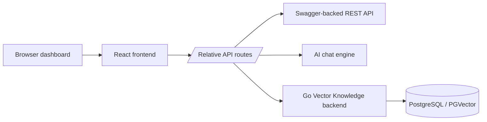
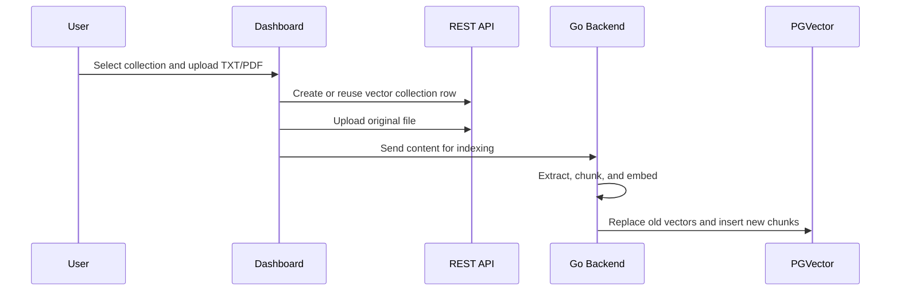

<div align="center">

# Intent & Agent Management Console

Swagger-driven operations console for configuring AI chatbot resources, vector knowledge, user access, and live chat workflows.

[](https://react.dev/)
[](https://vite.dev/)
[](https://nodejs.org/)
[](https://go.dev/)
[](package.json)

</div>

## Overview

Intent & Agent Management Console is an internal dashboard for managing the operational data behind an AI chatbot system. It connects to a Swagger-backed API, follows the project ERD, and keeps each resource workflow explicit instead of hiding API gaps behind mock data.

The repository also includes a Go Vector Knowledge backend for indexing TXT/PDF knowledge into PGVector-backed vector collections.

## Why It Exists

The app gives operators one place to manage:

- chatbot intents, actions, usecases, and action targets
- AI agents, utilities, and agent-utility mappings
- semantic search registries and vector collection files
- user, role, and usecase access
- AI chat testing against the configured chat engine
- vector knowledge uploads and indexing workflows

No fake fixture layer is included. If a page is empty, the connected API returned no data, failed, or the endpoint is unavailable.

## Stack

| Layer | Technology |
| --- | --- |
| Frontend | React `^19.2.6`, Vite `^8.0.16` |
| Routing | React Router `^7.16.0` |
| State | Zustand `^5.0.14` |
| Icons | Lucide React `^1.16.0` |
| Vector backend | Go, PGVector, embedding service integration |
| Runtime proxy | Vite dev proxy or production Node static/proxy server |

## System Flow



Runtime targets are configured outside the source tree. The root README intentionally avoids publishing internal hosts, server users, or deployment-specific paths.

## Feature Map

| Feature | Status | Notes |
| --- | --- | --- |
| Auth | Implemented | Login, persisted token, profile load, unauthorized logout |
| Intents | Implemented | CRUD with `usecase_id` and `action_id` relations |
| Usecases | Implemented | CRUD |
| Actions | Implemented | Conditional target fields by `action_type` |
| External Data | Implemented | CRUD |
| AI Agents | Implemented | CRUD |
| Agent Utilities | Partial | Create mapping only, matching API availability |
| Semantic Search | Implemented | CRUD and Action target registry |
| Utilities | Partial | List and create, matching API availability |
| Roles | Implemented | Admin-only list and create |
| Users | Implemented | Admin-only CRUD, role assignment, usecase assignment |
| Vector Collections | Implemented | Upload Knowledge and Collection Files workflows |
| AI Chat | Implemented | Sends real messages through the chat webhook workflow |

Unsupported backend operations stay disabled in the UI. The app should not invent client-only mock data for resources that are not exposed by the API.

## Quick Start

```bash
nvm install
nvm use
npm install
npm run dev
```

Validate the production bundle:

```bash
npm run build
```

Run the lightweight test command:

```bash
npm test
```

`npm test` currently runs the Vite production build.

## Configuration

The browser calls relative routes and lets the development or production proxy resolve the real targets:

```text
/api
/chat-webhook
/intent-sync
/vector-webhook
```

For this proxy-first setup, keep:

```env
VITE_API_BASE_URL=
```

Use the example files as templates:

```text
.env.example
.env.production.example
backend/.env.example
```

Never commit real `.env` files, database credentials, API keys, exported tokens, local uploads, or Postman collections.

## Repository Layout

```text
src/
  App.jsx                              Application shell and route wiring
  api/client.js                        Endpoint map and request helpers
  config/resources.js                  Feature registry and navigation groups
  config/resourceOptions.js            Shared enums and relation maps
  features/<feature-name>/             Feature-owned pages and configs
  templates/components/                Shared layout and form primitives
  templates/hooks/useResourceCrud.js   Shared CRUD behavior
  utils/resourceUtils.jsx              Labels, validation, transforms

backend/                               Go Vector Knowledge backend
docs/                                  API, ERD, UI/UX, and workflow notes
server-setup/                          Internal deployment helpers
```

## Development Pattern

Each sidebar page is owned by a feature folder:

```text
src/features/<feature-name>/
  Page.jsx
  config.js
  components/
```

Use this split:

| Change | Edit |
| --- | --- |
| Fields, labels, columns | `src/features/<feature-name>/config.js` |
| Page-specific layout | `src/features/<feature-name>/Page.jsx` |
| Shared CRUD behavior | `src/templates/hooks/useResourceCrud.js` |
| Shared UI primitives | `src/templates/components/` |
| API paths and availability | `src/api/client.js` |
| Sidebar registration | `src/config/resources.js` and `src/features/index.js` |

## Vector Knowledge Flow



Semantic Search stores the Action-facing `collection_name`. Vector Collections store native file rows. The ERD does not define a foreign key between those names, so the UI keeps them aligned by using the same collection name across both workflows.

## Backend

The Go backend under [backend/](backend/) handles:

- request validation
- PDF text extraction
- text chunking
- embedding calls
- PGVector writes
- optional auth-token validation through the main API

See [backend/README.md](backend/README.md) for backend setup and endpoint details.

## Documentation

| Document | Purpose |
| --- | --- |
| [docs/API_REFERENCE.md](docs/API_REFERENCE.md) | Endpoint payloads and API notes |
| [docs/API_ACCESS_STATUS.md](docs/API_ACCESS_STATUS.md) | Endpoint availability audit |
| [docs/NEW_ERD_SWAGGER_AUDIT_20260604.md](docs/NEW_ERD_SWAGGER_AUDIT_20260604.md) | ERD and Swagger alignment |
| [docs/UI_UX_PLAN.md](docs/UI_UX_PLAN.md) | UI/UX status and optional polish |
| [docs/PANDUAN_PENGERJAAN.md](docs/PANDUAN_PENGERJAAN.md) | Development guide |
| [docs/VECTOR_TEST_CLEANUP.md](docs/VECTOR_TEST_CLEANUP.md) | Cleanup guidance for accidental vector write tests |
| [backend/README.md](backend/README.md) | Go backend setup |
| [server-setup/README.md](server-setup/README.md) | Internal deployment guide |

## Deployment

Production deployment uses a built `dist` directory plus one of these runtime options:

- `server-setup/prod-server.mjs` for static serving and proxying
- `server-setup/nginx-interface-intent.conf` as an Nginx example

Detailed PM2 commands, runtime targets, and server-specific paths live in [server-setup/README.md](server-setup/README.md). Treat that folder as internal operational documentation if this repository is public.

## Security Notes

- Keep the repository private if it includes internal topology, deployment notes, or operational runbooks.
- Keep real `.env` files out of Git.
- Rotate secrets after account, token, email, or machine compromise, even if no secret is found in Git history.
- Avoid committing exported workflow credentials or local Postman collections.
- Do not run vector write smoke tests without a cleanup path.

## ERD

The ERD is available as:

- [ERD.mmd](ERD.mmd) - Mermaid source.
- [ERD_VIEW.html](ERD_VIEW.html) - browser-viewable Mermaid renderer.
